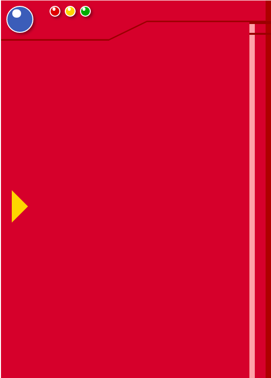
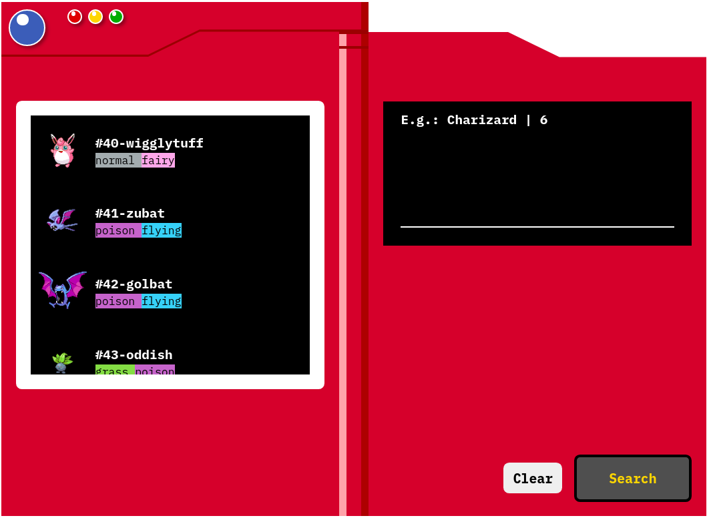
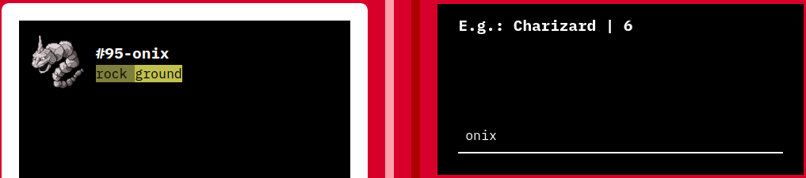
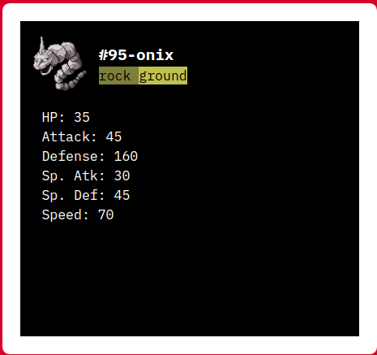

<p align="center">
  

  

  <a href="https://github.com/axpalx/pokedex-vue/commits/master">
    
  </a>
    
   
   <a href="https://github.com/axpalx/pokedex-vue/stargazers">
    
  </a>

  <a href="#">
    
  </a>

---

# Pokedex

<br>

## :memo: Descrição

Projeto desenvolvido utilizando o framework Vue JS, como forma de estudo do framework.

<br>

<h4 align="center"> 
	🚧   Pokedex em construção...   🚧
</h4>

<br>

---

<br>

## :chart_with_upwards_trend: Demostração

<br>

### Pokedex fechada



### Pokedex aberta



### Pesquisar Pokemon



### Ver status dos Pokemons



<br>

---

<br>

## :page_facing_up: Pré-requisitos

Antes de começar, você vai precisar ter instalado em sua máquina as seguintes ferramentas:
[Git](https://git-scm.com), [Node.js](https://nodejs.org/en/).
Além disto é bom ter um editor para trabalhar com o código como [VSCode](https://code.visualstudio.com/).

<br>

---

<br>

### :rocket: Como executar

```bash
# Clone este repositório
$ git clone https://github.com/axpalx/pokedex-vue

# Acesse a pasta do projeto
$ cd pokedex-vue

# Instale as dependências
$ npm install

# Execute a aplicação em modo de desenvolvimento
$ npm run serve

# O servidor inciará na porta:8080 - acesse <http://localhost:8080>
```

<br>

---

<br>

## :wrench: Tecnologias

As seguintes ferramentas foram usadas na construção do projeto:

- [Node.js](https://nodejs.org/en/)
- [VueJS](https://vuejs.org/)

<br>

---

<br>

## :construction_worker: Como contribuir para o projeto

1. Faça um **fork** do projeto.
2. Crie uma nova branch com as suas alterações: `git checkout -b my-feature`
3. Salve as alterações e crie uma mensagem de commit contando o que você fez: `git commit -m "feature: My new feature"`
4. Envie as suas alterações: `git push origin my-feature`

<br>

---

<br>

## :books: Autor

<br />

<a href="https://github.com/axpalx">
 
 
<strong>Alex Pulido</strong></a> <a href="https://github.com/axpalx" title="Alex"></a>

[](https://www.linkedin.com/in/alex-pulido-5b243758/) [](mailto:axpalx@gmail.com)

<br>

---

<br>

## :copyright: Licença

Este projeto esta sobe a licença [MIT](./LICENSE).
